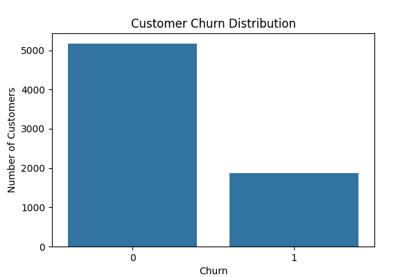
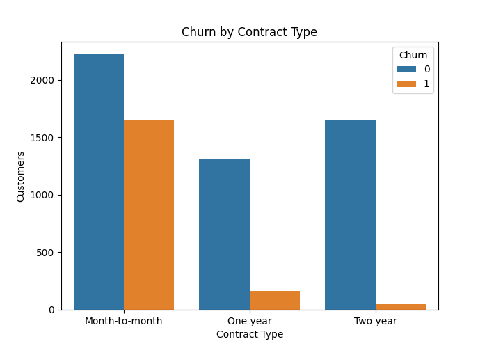
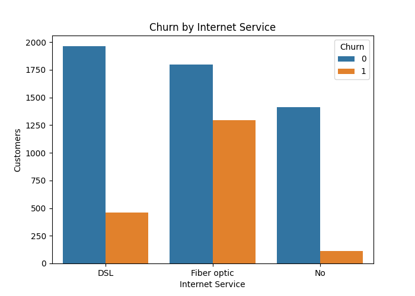
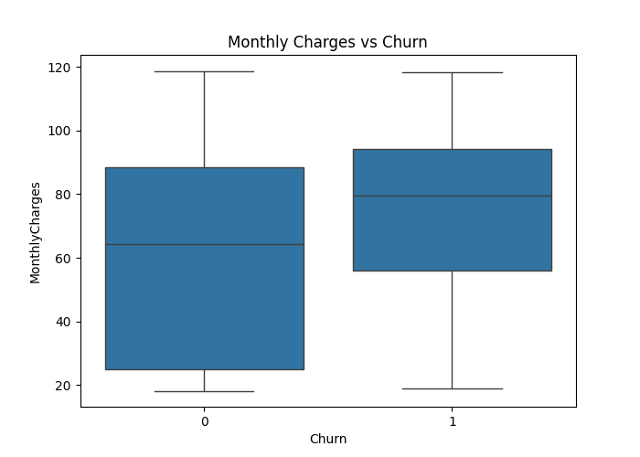
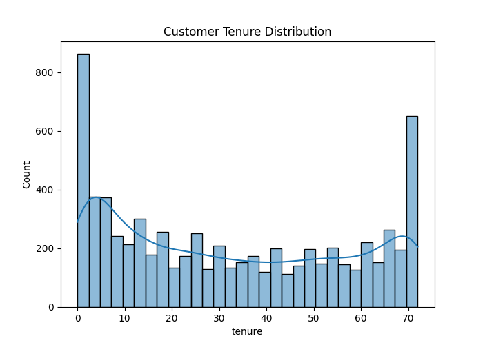

# Customer Retention & Churn Analysis

## 🔍 Project Overview
In many subscription-based businesses, retaining existing customers is as important as acquiring new ones. Customer churn directly impacts revenue and long-term growth. This project focuses on analyzing customer data from a telecommunications provider to identify patterns that lead to churn and provide actionable insights to improve retention.

This task was completed as part of the **Future Interns Data Science & Analytics Internship (Task 2 - 2026)**.

## 🎯 Objectives
The primary goal is to help business teams answer:
- **Why are customers leaving the platform?**
- **Which customer segments are most likely to churn?**
- **How long do customers typically stay active?**
- **What actions can improve customer retention?**

## 📊 Dataset Description
The analysis was performed on the **Telco Customer Churn Dataset**, which contains:
- **Customer Demographics**: Gender, Seniority, Partners, Dependents.
- **Service Information**: Phone service, Multiple lines, Internet service (DSL, Fiber optic), Online security, Tech support, Streaming TV/Movies.
- **Account details**: Tenure, Contract type, Payment method, Paperless billing, Monthly charges, Total charges.
- **Churn status**: Whether the customer left within the last month.

## 🛠️ Key Steps Involved
1. **Data Cleaning**: Handled missing values (specifically in `TotalCharges`), converted data types, and prepared the target variable for analysis.
2. **Exploratory Data Analysis (EDA)**: Investigated the distribution of churn across various demographics and services.
3. **Visualization**: Used Matplotlib and Seaborn to create intuitive charts showing correlations and drivers of churn.
4. **Insight Generation**: Derived business-focused conclusions from the data patterns.

## 📈 Analysis & Insights

### 1. Churn Distribution
The overall churn rate in the dataset is approximately **26.5%**. Understanding the baseline helps in measuring the effectiveness of future retention strategies.

### 2. Contract Type and Retention
Customers on **Month-to-month** contracts are significantly more likely to churn compared to those on one or two-year contracts. 
- **Actionable Insight**: Offering discounts or loyalty rewards for moving to longer-term contracts can drastically reduce churn.

### 3. Internet Service Impact
Interestingly, customers using **Fiber Optic** service have a higher churn rate compared to DSL users. This suggests possible issues with service reliability or price sensitivity in this segment.
- **Actionable Insight**: Targeted feedback surveys should be sent to fiber optic users to understand service pain points.

### 4. Financial Drivers (Monthly Charges)
Churned customers tend to have **higher median monthly charges**. Pricing pressure is a clear indicator of customer departure.
- **Actionable Insight**: Periodic "Loyalty Discounts" or bundle optimization for high-paying customers could prevent exit.

### 5. Tenure and Lifetime
Customers with **shorter tenure** (especially in the first 6 months) represent the highest churn risk. Once a customer stays past 2 years, retention rates improve significantly.
- **Actionable Insight**: Onboarding programs and "First 90 Days" engagement campaigns are crucial.

## 💡 Business Recommendations
Based on the analysis, the following strategies are recommended:
1. **Contract Incentives**: Transition month-to-month customers to annual plans through promotional offers.
2. **Onboarding Focus**: Create high-touch engagement for new customers in their initial months.
3. **Service Quality Review**: Audit Fiber Optic service performance as it shows unexpectedly high churn.
4. **Value-Add Services**: Customers with "Tech Support" and "Online Security" were found to stay longer. Bundling these services can improve stickiness.

## 🚀 How to Run
1. Clone the repository.
2. Ensure you have `pandas`, `seaborn`, and `matplotlib` installed.
3. Open `churn_analysis.ipynb` in Jupyter Notebook or VS Code to see the full code and detailed analysis.

---
*Created by Aryan - Future Interns Internship 2026*
